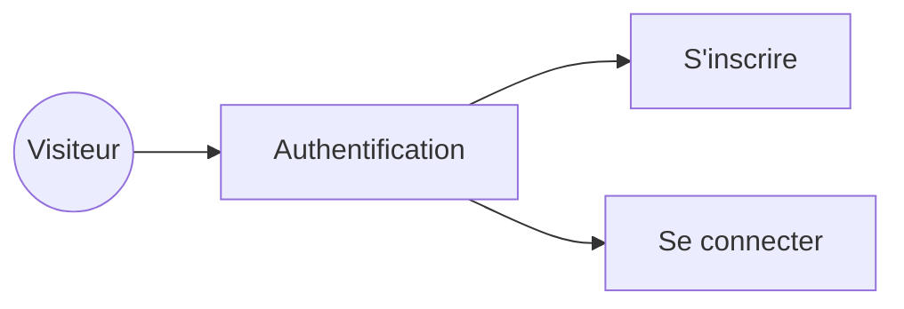
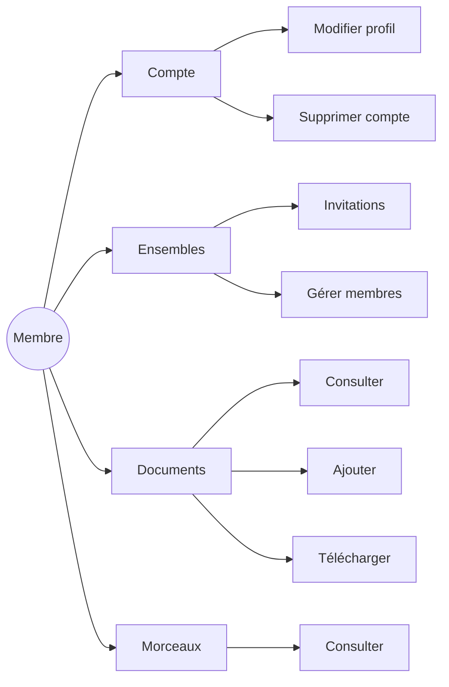
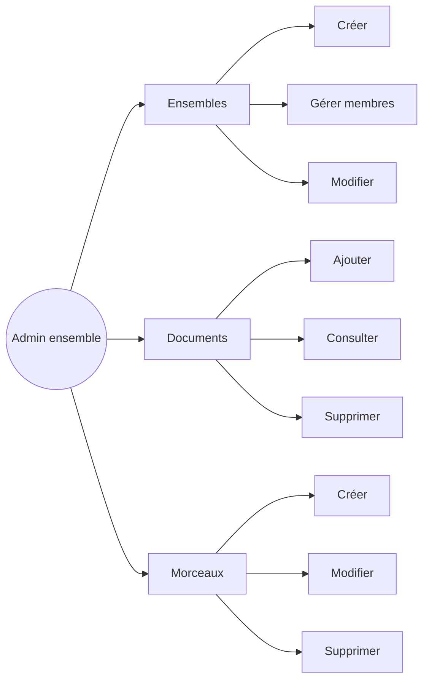
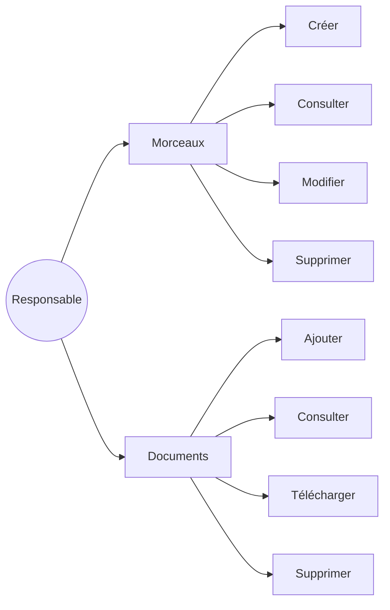
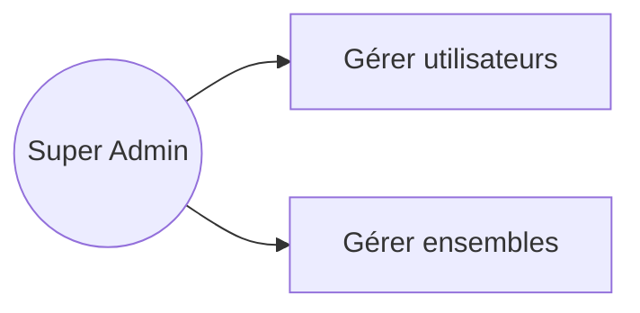
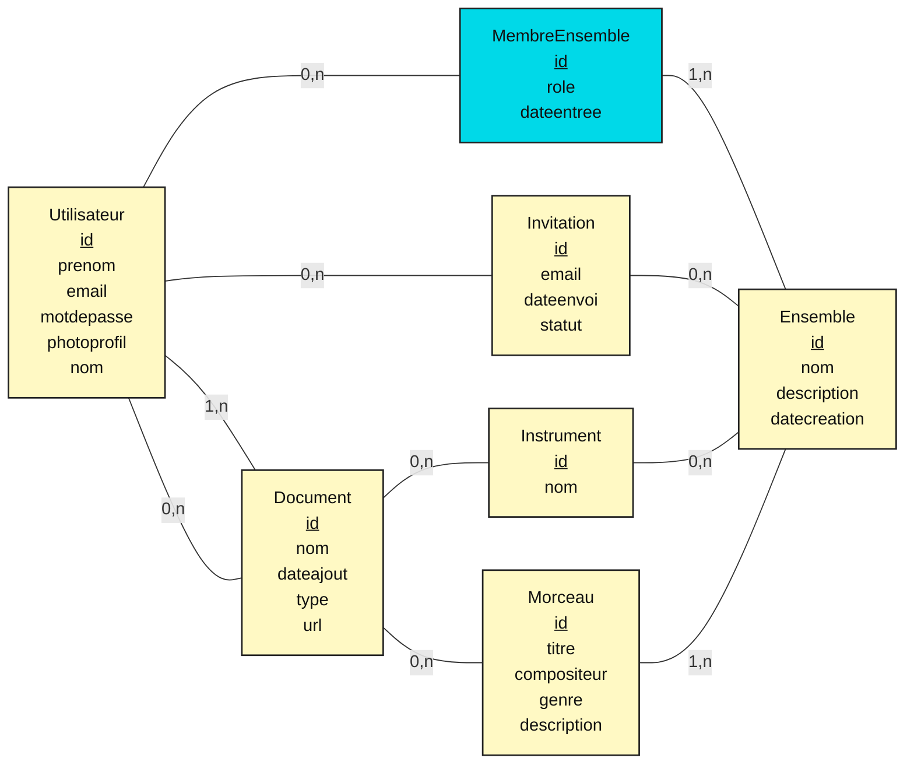
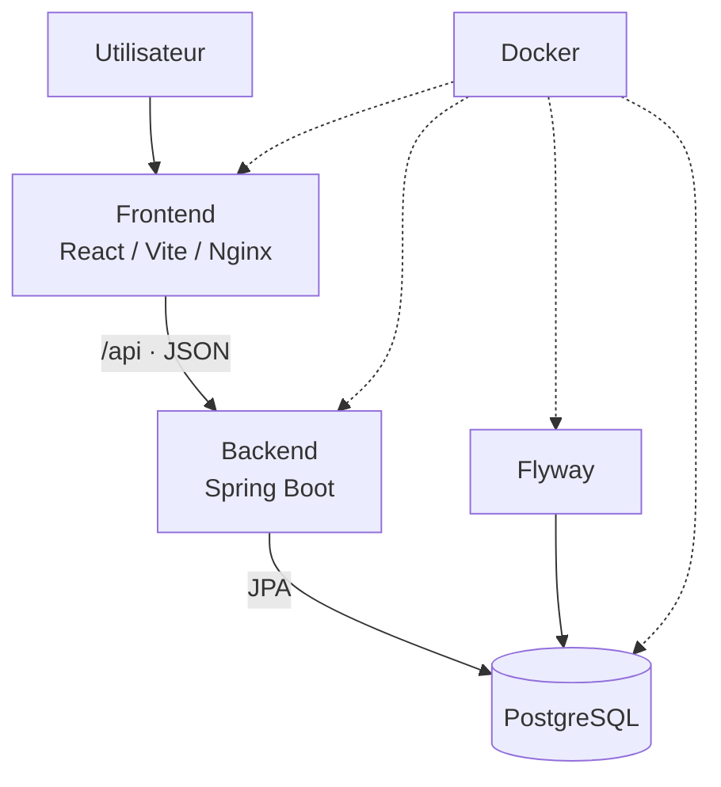
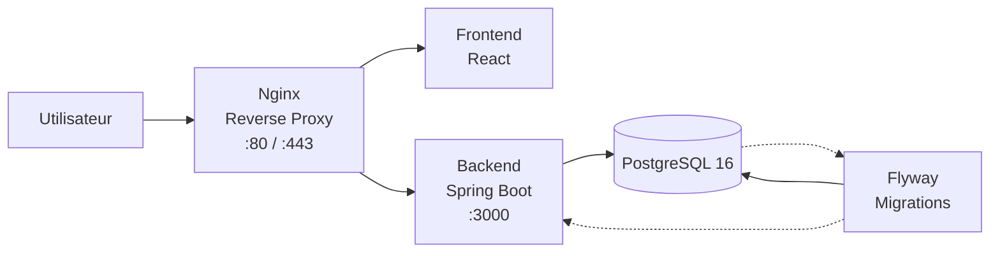

<!-- 1 -->
<div class="hero h-full -m-12 p-12 flex flex-col justify-between">
  <div class="hero-mark">♫</div>
  <div>
    <div class="eyebrow">Projet de développement web</div>
    <h1 class="!text-6xl !mt-3">Partitio</h1>
    <p class="subtitle">La bibliothèque musicale collaborative des ensembles.</p>
  </div>
  <div class="text-sm text-purple-100">Martinez, Calassou, Dufau · CDA · 2026</div>
</div>

---

<!-- 2 -->
<div class="eyebrow">01 · Introduction</div>

# Problématique

<div class="grid2 mt-8">
<div class="card"><h3>Des ressources dispersées</h3><p>Partitions, fichiers et informations de répétition sont souvent répartis entre plusieurs outils et personnes.</p></div>
<div class="card"><h3>Un besoin de repère commun</h3><p>Un ensemble doit pouvoir retrouver rapidement son répertoire et collaborer au même endroit.</p></div>
</div>

<p class="mt-8"><strong>Partitio</strong> répond à ce besoin avec un espace simple pour organiser les morceaux, documents et ensembles.</p>

---

<!-- 3 -->
<div class="eyebrow">01 · Introduction</div>

# Objectifs

<div class="grid3 mt-8">
<div class="card"><div class="metric">01</div><h3>Centraliser</h3><p>Réunir le répertoire et les partitions.</p></div>
<div class="card"><div class="metric">02</div><h3>Collaborer</h3><p>Créer des ensembles et gérer leurs membres.</p></div>
<div class="card"><div class="metric">03</div><h3>Sécuriser</h3><p>Protéger l'accès aux données utilisateurs.</p></div>
</div>

---

<!-- 4 -->
<div class="eyebrow">02 · L'application</div>

# Partitio en quelques mots

<div class="grid2 items-center mt-5">
  <div>
    <p class="subtitle">Une application web de gestion de répertoire pensée pour les musiciens et leurs ensembles.</p>
    <ul class="mt-7">
      <li>un tableau de bord pour le suivi quotidien</li>
      <li>un catalogue de morceaux et de documents</li>
      <li>des espaces d'ensemble, invitations et rôles.</li>
    </ul>
  </div>
  <div class="mockup">
    
  </div>
</div>

---

<!-- 5 -->
<div class="eyebrow">02 · L'application</div>

# Les fonctionnalités principales

<div class="grid3 mt-6">
  <div class="feature-card">
    <div class="feature-card-content">
      <h3>Gestion des morceaux</h3>
      <p>Créer/Modification/Suppression</p>
    </div>
  </div>

  <div class="feature-card">
    <div class="feature-card-content">
      <h3>Organisation des ensembles</h3>
      <p>Création/Rejoindre/Gestion</p>
    </div>
  </div>
</div>

---

<!-- 6 -->
<div class="eyebrow">02 · L'application</div>

# Le dashboard

<div class="grid2 items-center mt-6">

<div>
  <p class="subtitle">
    Un point d'entrée central pour retrouver rapidement son répertoire et ses ensembles.
  </p>

  <div class="card mt-6">
    <h3>Ce que l'utilisateur retrouve</h3>
    <ul>
      <li>son répertoire récent</li>
      <li>ses ensembles</li>
      <li>les informations importantes du compte.</li>
    </ul>
  </div>
</div>

<div class="screenshot-frame">
  
</div>

</div>

---

<!-- 7 -->
<div class="eyebrow">02 · L'application</div>

# Gérer ses morceaux

<div class="grid2 mt-6">

<div class="screenshot-frame">
  
  <div class="screenshot-label">Catalogue des morceaux</div>
</div>

<div>
  <div class="card">
    <div class="metric">01</div>
    <h3>Créer</h3>
    <p>Ajouter un nouveau morceau à son répertoire.</p>
  </div>

  <div class="card mt-3">
    <div class="metric">02</div>
    <h3>Consulter</h3>
    <p>Retrouver les informations et le contenu associé.</p>
  </div>

  <div class="card mt-3">
    <div class="metric">03</div>
    <h3>Supprimer</h3>
    <p>Gérer les morceaux présents dans le répertoire.</p>
  </div>
</div>

</div>

---

<!-- 8 -->
<div class="eyebrow">02 · L'application</div>

# Un morceau centralise ses documents

<div class="grid2 mt-5">

<div class="screenshot-frame">
  
  <div class="screenshot-label">Détail d'un morceau</div>
</div>

<div class="screenshot-frame">
  
  <div class="screenshot-label">Documents associés</div>
</div>

</div>

<p class="muted mt-5 text-center">
  Les documents sont directement associés au morceau.
</p>

---

<!-- 9 -->
<div class="eyebrow">02 · L'application</div>

# Travailler en ensemble

<div class="grid2 items-center mt-6">

<div class="screenshot-frame">
  
</div>

<div>
  <p class="subtitle">
    Les ensembles permettent de regrouper les musiciens autour d'un même espace.
  </p>

  <div class="card mt-5">
    <h3>Gestion collaborative</h3>
    <ul>
      <li>création d'un ensemble</li>
      <li>invitation de membres</li>
      <li>adhésion à un ensemble</li>
      <li>gestion des membres.</li>
    </ul>
  </div>
</div>

</div>


---

<!-- 10 -->
<div class="eyebrow">03 · Conception</div>

# Analyse des besoins

<div class="grid2 mt-6">
  <div class="card"><h3>Fonctionnels</h3><ul><li>Authentifier les utilisateurs</li><li>Gérer les morceaux</li><li>Créer et rejoindre des ensembles</li><li>Consultation d'une fiche morceau</li></ul></div>
  <div class="card"><h3>Non fonctionnels</h3><ul><li>Interface responsive</li><li>Sécurisation 100% de l'API</li><li>Ajout/Gestion/Suppression d'un ensemble</li></ul></div>
</div>

---

<!-- 11 -->
<div class="eyebrow">03 · Conception</div>

# User stories

<div class="card mt-5"><span class="pill">Musicien</span><h3 class="mt-3">« En tant que musicien, je veux créer un ensemble afin de pouvoir travailler avec d'autres musiciens. »</h3></div>
<div class="card mt-4"><span class="pill">Membre</span><h3 class="mt-3">« En tant que membre, je veux accéder aux morceaux et documents de mon ensemble afin de les préparer. »</h3></div>

---

<!-- 12 -->
<div class="eyebrow">03 · Conception</div>

# Choix Technologiques

<div class="flow"><div class="node hot">React<br><small>Interface</small></div><div class="arrow">HTTP / JSON</div><div class="node hot">Spring Boot<br><small>API</small></div><div class="arrow">ORM</div><div class="node hot">PostgreSQL<br><small>Données</small></div></div>

<div class="grid3 mt-10"><div class="card"><h3>React + Vite</h3><p>Composants réutilisables et environnement de développement rapide.</p></div><div class="card"><h3>Spring Boot</h3><p>Structure robuste pour l'API Java, la validation et les tests.</p></div><div class="card"><h3>Docker + Flyway</h3><p>Environnement reproductible et schéma de base versionné.</p></div></div>

---

<!-- 13 -->
<div class="eyebrow">04 · Diagrammes</div>

# Cas d'utilisation - Visiteur

---

<!-- 14 -->
<div class="eyebrow">04 · Diagrammes</div>

# Cas d'utilisation - Membre



--- 

<!-- 15 -->
<div class="eyebrow">04 · Diagrammes</div>

# Cas d'utilisation - Admin d'ensemble



--- 

<!-- 16 -->
<div class="eyebrow">04 · Diagrammes</div>

# Cas d'utilisation - Responsable d'ensemble


--- 

<!-- 17 -->
<div class="eyebrow">04 · Diagrammes</div>

# Cas d'utilisation - Super Admin


--- 

<!-- 18 -->
<div class="eyebrow">04 · Diagrammes</div>

# MCD



<div class="grid3 mt-2"><div class="card"><h3>User</h3><p>Compte, e-mail vérifié, mot de passe haché.</p></div><div class="card"><h3>EnsembleMember</h3><p>Table de liaison, rôle et statut du membre.</p></div><div class="card"><h3>Piece & Document</h3><p>Un morceau possède plusieurs documents.</p></div></div>

---

<!-- 19 -->
<div class="eyebrow">04 · Diagrammes</div>

# Architecture applicative



---

<!-- 20 -->
<div class="eyebrow">04 · Diagrammes</div>

# Flux d'une requête : les morceaux

<div class="flow"><div class="node">React</div><div class="arrow">→</div><div class="node hot">GET<br>/api/pieces</div><div class="arrow">→</div><div class="node">PieceController</div><div class="arrow">→</div><div class="node">Repository</div><div class="arrow">→</div><div class="node">PostgreSQL</div></div>

<p class="mt-10 card">Le contrôleur récupère les entités, construit les DTOs <code>PieceDto</code> et <code>DocumentDto</code>, puis renvoie du JSON au frontend.</p>

---

<!-- 21 -->

<div class="eyebrow">05 · Organisation</div>

# Organisation de l'équipe

<div class="grid2 mt-7">
  <div class="card">
    <h3>🗂️ Travail en sprints</h3>
    <p>
      Développement organisé en <strong>sprints</strong> avec des objectifs définis
      au début de chaque itération.
    </p>
    <p>
      Chaque fonctionnalité est découpée en tâches et priorisée dans le backlog.
    </p>
  </div>

  <div class="card">
    <h3>📋 Jira</h3>
    <p>
      Jira nous permet de gérer le <strong>backlog</strong>, créer et attribuer
      les tickets, suivre leur avancement et organiser les sprints.
    </p>
    <p>
      Les tickets passent progressivement de <strong>À faire → En cours → Terminé</strong>.
    </p>
  </div>
</div>

<div class="flow">
  <span class="node">Backlog</span>
  <div class="arrow">→</div>
  <span class="node">Sprint Planning</span>
  <div class="arrow">→</div>
  <span class="node">Développement</span>
  <div class="arrow">→</div>
  <span class="node">Review</span>
</div>

---

<!-- 22 -->
<div class="eyebrow">05 · Organisation</div>

# Gestion du projet

<div class="flow"><div class="node">Issue</div><div class="arrow">→</div><div class="node">Branche</div><div class="arrow">→</div><div class="node hot">Développement</div><div class="arrow">→</div><div class="node">Tests</div><div class="arrow">→</div><div class="node">Pull Request / Merge</div></div>

<div class="grid3 mt-10"><div class="card"><h3>Git</h3><p>Historique et travail parallèle.</p></div><div class="card"><h3>CI/CD</h3><p>Build et déploiement sur les branches <code>dev</code> et <code>main</code>.</p></div><div class="card"><h3>Traçabilité</h3><p>À illustrer avec vos vrais issues, commits ou tableau Kanban.</p></div></div>

---

<!-- 23 -->
<div class="eyebrow">06 · Développement</div>

# Frontend : une interface par composants

```jsx
function App() {
  return (
    <BrowserRouter>
      <Routes>
        <Route path="/" element={<HomePage />} />
        <Route path="/signup" element={<SignUp />} />
        <Route path="/login" element={<Login />} />
        <Route path="/dashboard" element={<Dashboard />} />
        <Route path="/piece" element={<Piece />} />
        <Route path="/profilpage" element={<Profil />} />
        <Route path="/ensembles" element={<Ensemble />}/>
        <Route path="/users" element={<Users />}/>
        <Route path="/roles" element={<Roles />}/>
        <Route path="/piece/:id" element={<PieceDetails />}/>
      </Routes>
    </BrowserRouter>
  )
}
```
---

<!-- 24 -->
<div class="eyebrow">06 · Développement</div>

# Backend : une API REST Spring Boot

```java
@RestController
@RequestMapping("/api/pieces")
public class PieceController {
  @GetMapping
  public List<PieceDto> getAll() {
    Iterable<Piece> pieces = repository
      .findAllByOrderByDateAddedDesc(Sort.by("dateAdded").descending());
    // Transformation des entités et documents en DTOs JSON
  }
}
```

<p class="mt-4">Les endpoints regroupent authentification, profil, morceaux, documents, envois d'images et ensembles.</p>

---

<!-- 25 -->
<div class="eyebrow">06 · Développement</div>

# Une fonctionnalité de bout en bout

<div class="flow"><div class="node">Formulaire React</div><div class="arrow">→</div><div class="node hot">POST<br>/api/pieces</div><div class="arrow">→</div><div class="node">PieceController</div><div class="arrow">→</div><div class="node">Repository.save</div><div class="arrow">→</div><div class="node">BDD</div></div>

<div class="card mt-10"><h3>Pourquoi cette lecture est utile ?</h3><p>Elle montre comment une action visible côté utilisateur devient une requête HTTP, une opération métier et une donnée persistée.</p></div>

---

<!-- 26 -->
<div class="eyebrow">07 · Qualité</div>

# Stratégie de test

<div class="grid3 mt-7"><div class="card"><h3>Unitaires</h3><p>DTOs, validations et service JWT.</p></div><div class="card"><h3>Contrôleurs</h3><p>Santé, inscription, connexion, déconnexion, profil.</p></div><div class="card"><h3>Persistance</h3><p>Tests des repositories, notamment utilisateurs.</p></div></div>

<p class="mt-9">Le backend contient actuellement <strong>12 classes de tests</strong> : le test accompagne les parcours et les règles essentielles de l'API.</p>

---

<!-- 27 -->
<div class="eyebrow">07 · Qualité</div>

# Exemple : vérifier l'authentification

```java
@Test
void loginWithInvalidPasswordReturnsUnauthorized() throws Exception {
  mockMvc.perform(post("/api/login")
      .contentType(MediaType.APPLICATION_JSON)
      .content("{\"email\":\"user@example.com\",\"password\":\"wrong\"}"))
    .andExpect(status().isUnauthorized());
}
```

<div class="grid2 mt-6"><div class="card"><h3>Ce que l'on vérifie</h3><p>Une tentative avec un mauvais mot de passe est refusée.</p></div><div class="card"><h3>Pourquoi</h3><p>Les erreurs et les accès non autorisés doivent produire une réponse maîtrisée.</p></div></div>

---

<!-- 28 -->
<div class="eyebrow">07 · Qualité</div>

# Résultats attendus des tests

<div class="grid3 mt-7"><div class="card"><div class="check">✓</div><h3>Fonctionnel</h3><p>Parcours d'inscription et connexion.</p></div><div class="card"><div class="check">✓</div><h3>API</h3><p>Endpoints et formats de réponse.</p></div><div class="card"><div class="check">✓</div><h3>Sécurité</h3><p>Validation, session et droits.</p></div></div>

<p class="muted mt-10">À compléter pendant la répétition avec le résultat réel de <code>mvn test</code> et, si disponible, la couverture JaCoCo.</p>

---

<!-- 29 -->
<div class="eyebrow">08 · Sécurité</div>

# Menaces identifiées

<div class="grid3 mt-6"><div class="card"><h3>Entrées malveillantes</h3><p>Injection SQL et XSS.</p></div><div class="card"><h3>Identité</h3><p>Vol de token, mot de passe faible, session détournée.</p></div><div class="card"><h3>Accès</h3><p>Exposition de données ou action hors périmètre.</p></div></div>

<p class="mt-8">La sécurité se pense dès la conception : données acceptées, identité de l'utilisateur et autorisation de chaque action.</p>

---

<!-- 30 -->
<div class="eyebrow">08 · Sécurité</div>

# Mesures présentes dans Partitio

<div class="grid2 mt-5"><div class="card"><h3>Protection des identifiants</h3><ul><li>hachage via <strong>Argon2</strong></li><li>JWT configuré par variables d'environnement</li><li>vérification de l'adresse e-mail.</li></ul></div><div class="card"><h3>Protection de l'API</h3><ul><li>DTOs pour maîtriser les données exposées</li><li>validation Spring</li><li>CORS limité aux origines de développement prévues</li><li>contrôles de rôles dans les parcours d'ensemble.</li></ul></div></div>

---

<!-- 31 -->
<div class="eyebrow">08 · Sécurité</div>

# Veille : une boucle continue

<div class="flow"><div class="node">OWASP · ANSSI<br>éditeurs · CVE</div><div class="arrow">→</div><div class="node">Identifier<br>une alerte</div><div class="arrow">→</div><div class="node hot">Évaluer l'impact</div><div class="arrow">→</div><div class="node">Mettre à jour<br>ou corriger</div></div>

<p class="mt-10">Veille : Insecure Design</p>

---

<!-- 32 -->
<div class="eyebrow">09 · Déploiement</div>

# Pourquoi Docker ?

<div class="grid3 mt-8"><div class="card"><h3>Reproductibilité</h3><p>Le même environnement pour chaque développeur.</p></div><div class="card"><h3>Isolation</h3><p>Les dépendances sont contenues par service.</p></div><div class="card"><h3>Déploiement</h3><p>Une stack claire à lancer et à faire évoluer.</p></div></div>

<p class="mt-10 text-xl">« Ça fonctionne sur mon poste » devient une configuration versionnée et partagée.</p>

---

<!-- 33 -->
<div class="eyebrow">09 · Déploiement</div>

# Architecture Docker locale



---

<!-- 34 -->
<div class="eyebrow">09 · Déploiement</div>

# Docker Compose orchestre les services

```yaml
services:
  postgres:
    image: postgres:16-alpine
    healthcheck:
      test: ["CMD-SHELL", "pg_isready ..."]

  flyway:
    image: flyway/flyway:11-alpine
    depends_on:
      postgres:
        condition: service_healthy

  backend:
    build: ./backend
    depends_on:
      flyway:
        condition: service_completed_successfully

  frontend:
    build: ./partitio
    ports: ["${FRONTEND_PORT}:8080"]
```

---

<!-- 35 -->
<div class="eyebrow">09 · Déploiement</div>

# Du dépôt à l'application accessible

<div class="flow"><div class="node">Push GitHub</div><div class="arrow">→</div><div class="node hot">GitHub Actions</div><div class="arrow">→</div><div class="node">Image Docker Hub</div><div class="arrow">→</div><div class="node">VPS</div><div class="arrow">→</div><div class="node">Partitio</div></div>

<div class="grid2 mt-9"><div class="card"><h3>Branche <code>dev</code></h3><p>Image taguée <code>:dev</code> et service de développement.</p></div><div class="card"><h3>Branche <code>main</code></h3><p>Image taguée <code>:prod</code> et service de production.</p></div></div>

---

<!-- 36 -->
<div class="hero h-full -m-12 p-12 flex flex-col justify-center">
  <div class="eyebrow">10 · Démonstration</div>
  <h1 class="!text-5xl">Partitio en action</h1>
  <div class="grid2 mt-8 text-slate-900"><div class="card"><h3>Scénario</h3><p>Connexion → Dashboard → création / consultation d'un morceau → ensemble → invitation / rôle.</p></div></div>
</div>

---

<!-- 37 -->
<div class="eyebrow">11 · Conclusion</div>

# Bilan & perspectives

<div class="grid3 mt-7"><div class="card"><h3>Réalisé</h3><p>Une application full stack, un répertoire, des ensembles, une API testée et conteneurisée.</p></div><div class="card"><h3>Apprentissages</h3><p>Conception d'API, persistance, authentification, collaboration et déploiement.</p></div><div class="card"><h3>Suite possible</h3><p>Finir le Must Have, Améliorer l'UX, continuer à sécuriser l'API, affiner les droits et enrichir la collaboration.</p></div></div>

---

<!-- 38 -->
<div class="hero h-full -m-12 p-12 flex flex-col justify-center items-center text-center">
  <div class="hero-mark">♫</div>
  <h1 class="!text-6xl !mt-8">Merci</h1>
  <p class="subtitle">Des questions ?</p>
  <p class="text-purple-100 mt-12">Partitio — La bibliothèque musicale collaborative des ensembles.</p>
</div>
