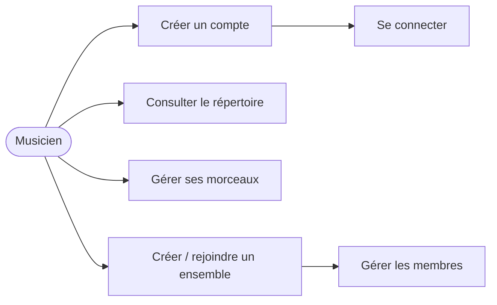
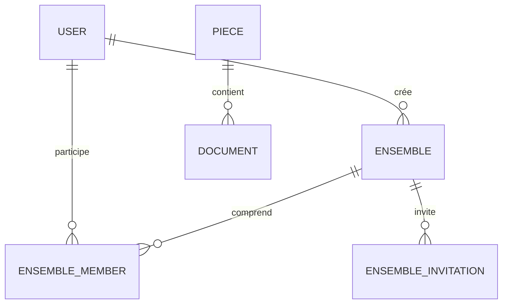
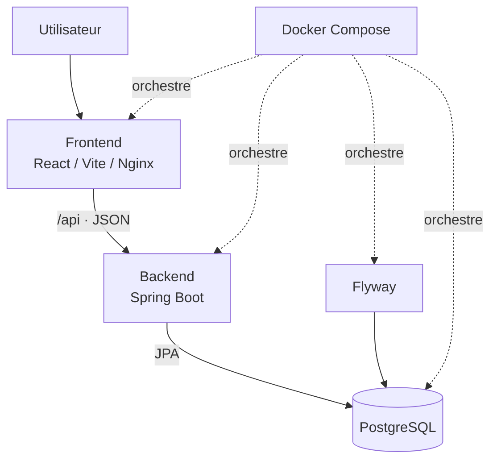
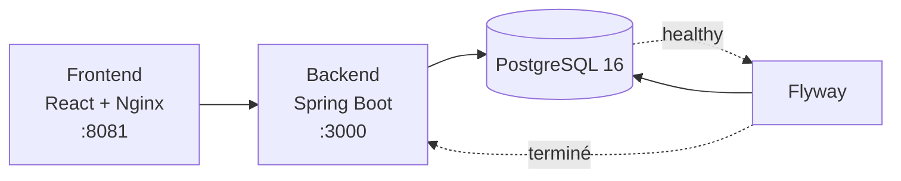

<!-- 1 -->
<div class="hero h-full -m-12 p-12 flex flex-col justify-between">
  <div class="hero-mark">♫</div>
  <div>
    <div class="eyebrow">Projet de développement web</div>
    <h1 class="!text-6xl !mt-3">Partitio</h1>
    <p class="subtitle">La bibliothèque musicale collaborative des ensembles.</p>
  </div>
  <div class="text-sm text-purple-100">À compléter · Nom · Formation · Date de soutenance</div>
</div>

---

<!-- 2 -->
<div class="eyebrow">01 · Introduction</div>

# Le point de départ

<div class="grid2 mt-8">
<div class="card"><h3>Des ressources dispersées</h3><p>Partitions, fichiers et informations de répétition sont souvent répartis entre plusieurs outils et personnes.</p></div>
<div class="card"><h3>Un besoin de repère commun</h3><p>Un ensemble doit pouvoir retrouver rapidement son répertoire et collaborer au même endroit.</p></div>
</div>

<p class="mt-8"><strong>Partitio</strong> répond à ce besoin avec un espace simple pour organiser les morceaux, documents et ensembles.</p>

---

<!-- 3 -->
<div class="eyebrow">01 · Introduction</div>

# Nos objectifs

<div class="grid3 mt-8">
<div class="card"><div class="metric">01</div><h3>Centraliser</h3><p>Réunir le répertoire et les partitions.</p></div>
<div class="card"><div class="metric">02</div><h3>Collaborer</h3><p>Créer des ensembles et gérer leurs membres.</p></div>
<div class="card"><div class="metric">03</div><h3>Sécuriser</h3><p>Protéger l'accès aux données utilisateurs.</p></div>
</div>

---

<!-- 4 -->
<div class="eyebrow">02 · L'application</div>

# Partitio en quelques mots

<div class="grid2 items-center mt-5">
<div>
  <p class="subtitle">Une application web de gestion de répertoire pensée pour les musiciens et leurs ensembles.</p>
  <ul class="mt-7">
    <li>un tableau de bord pour le suivi quotidien ;</li>
    <li>un catalogue de morceaux et de documents ;</li>
    <li>des espaces d'ensemble, invitations et rôles.</li>
  </ul>
</div>
<div class="mockup">
  <div class="mockup-top"><i></i><i></i><i></i></div><div class="mockup-nav">♫ partitio <span class="float-right text-xs">Dashboard</span></div>
  <div class="mockup-body"><b>Bonjour, Alex</b><p class="small muted">Votre répertoire</p><div class="piece-row"><span class="cover"></span><span><b>La Bohème</b><br><small class="muted">Charles Aznavour</small></span><span class="pill ml-auto">Pop</span></div><div class="piece-row"><span class="cover !bg-teal-500"></span><span><b>Hallelujah</b><br><small class="muted">Leonard Cohen</small></span><span class="pill ml-auto">Chorale</span></div></div>
</div>
</div>

---

<!-- 5 -->
<div class="eyebrow">02 · L'application</div>

# Fonctionnalités livrées

<div class="grid3 mt-6">
<div class="card"><h3>Répertoire</h3><p>Création, consultation et suppression de morceaux ; informations et visuels associés.</p></div>
<div class="card"><h3>Documents</h3><p>Association de documents et de voix aux morceaux.</p></div>
<div class="card"><h3>Ensembles</h3><p>Création, invitation, adhésion et gestion des membres.</p></div>
<div class="card"><h3>Compte</h3><p>Inscription, vérification de l'e-mail, connexion et profil.</p></div>
<div class="card"><h3>Rôles</h3><p>Gestion des rôles au sein d'un ensemble et des droits associés.</p></div>
<div class="card"><h3>Administration</h3><p>Vues dédiées aux utilisateurs et aux rôles.</p></div>
</div>

---

<!-- 6 -->
<div class="eyebrow">02 · L'application</div>

# Un parcours utilisateur concret

<div class="flow"><div class="node">Connexion</div><div class="arrow">→</div><div class="node hot">Dashboard</div><div class="arrow">→</div><div class="node">Morceaux</div><div class="arrow">→</div><div class="node">Documents & détails</div></div>

<div class="grid2 mt-10"><div class="card"><h3>Objectif utilisateur</h3><p>Retrouver un morceau, accéder à ses documents et préparer une répétition sans chercher dans plusieurs canaux.</p></div><div class="card"><h3>Valeur produit</h3><p>Le parcours relie une navigation claire à une API qui centralise les données du groupe.</p></div></div>

---

<!-- 7 -->
<div class="eyebrow">03 · Conception</div>

# Analyse des besoins

<div class="grid2 mt-6">
<div class="card"><h3>Fonctionnels</h3><ul><li>authentifier les utilisateurs ;</li><li>gérer le répertoire et les documents ;</li><li>créer et rejoindre des ensembles ;</li><li>gérer les membres et leurs rôles.</li></ul></div>
<div class="card"><h3>Non fonctionnels</h3><ul><li>interface responsive ;</li><li>API maintenable et testable ;</li><li>protection des données ;</li><li>déploiement reproductible.</li></ul></div>
</div>

---

<!-- 8 -->
<div class="eyebrow">03 · Conception</div>

# Des besoins aux user stories

<div class="card mt-5"><span class="pill">Musicien</span><h3 class="mt-3">« En tant que musicien, je veux créer un ensemble afin de pouvoir travailler avec d'autres musiciens. »</h3></div>
<div class="card mt-4"><span class="pill">Membre</span><h3 class="mt-3">« En tant que membre, je veux accéder aux morceaux et documents de mon ensemble afin de les préparer. »</h3></div>
<div class="card mt-4"><span class="pill">Administrateur</span><h3 class="mt-3">« En tant qu'administrateur, je veux gérer les rôles afin de maîtriser les accès. »</h3></div>

---

<!-- 9 -->
<div class="eyebrow">03 · Conception</div>

# Des choix techniques cohérents

<div class="flow"><div class="node hot">React<br><small>Interface</small></div><div class="arrow">HTTP / JSON</div><div class="node hot">Spring Boot<br><small>API</small></div><div class="arrow">JPA</div><div class="node hot">PostgreSQL<br><small>Données</small></div></div>

<div class="grid3 mt-10"><div class="card"><h3>React + Vite</h3><p>Composants réutilisables et environnement de développement rapide.</p></div><div class="card"><h3>Spring Boot</h3><p>Structure robuste pour l'API Java, la validation et les tests.</p></div><div class="card"><h3>Docker + Flyway</h3><p>Environnement reproductible et schéma de base versionné.</p></div></div>

---

<!-- 10 -->
<div class="eyebrow">04 · Diagrammes</div>

# Cas d'utilisation



<p class="small muted mt-4">À remplacer si besoin par votre diagramme UML final, exporté depuis votre outil de modélisation.</p>

---

<!-- 11 -->
<div class="eyebrow">04 · Diagrammes</div>

# Les principales entités



<div class="grid3 mt-2"><div class="card"><h3>User</h3><p>Compte, e-mail vérifié, mot de passe haché.</p></div><div class="card"><h3>EnsembleMember</h3><p>Table de liaison, rôle et statut du membre.</p></div><div class="card"><h3>Piece & Document</h3><p>Un morceau possède plusieurs documents.</p></div></div>

---

<!-- 12 -->
<div class="eyebrow">04 · Diagrammes</div>

# Modèle de données & migrations

<div class="grid2 mt-6"><div class="card"><h3>Tables métier</h3><ul><li><code>users</code></li><li><code>ensembles</code></li><li><code>ensemble_members</code></li><li><code>ensemble_invitations</code></li><li><code>pieces</code> et <code>documents</code></li></ul></div><div class="card"><h3>Versionnement</h3><p>Les migrations SQL sont numérotées et exécutées par <strong>Flyway</strong> avant le démarrage du backend.</p><p class="mt-4 small">V1 à V11 : utilisateurs, vérification e-mail, morceaux, documents, ensembles, invitations et rôles.</p></div></div>

---

<!-- 13 -->
<div class="eyebrow">04 · Diagrammes</div>

# Architecture applicative



---

<!-- 14 -->
<div class="eyebrow">04 · Diagrammes</div>

# Flux d'une requête : les morceaux

<div class="flow"><div class="node">React</div><div class="arrow">→</div><div class="node hot">GET<br>/api/pieces</div><div class="arrow">→</div><div class="node">PieceController</div><div class="arrow">→</div><div class="node">Repository</div><div class="arrow">→</div><div class="node">PostgreSQL</div></div>

<p class="mt-10">Le contrôleur récupère les entités, construit les DTOs <code>PieceDto</code> et <code>DocumentDto</code>, puis renvoie du JSON au frontend.</p>

---

<!-- 15 -->
<div class="eyebrow">05 · Organisation</div>

# Organisation de l'équipe

<div class="grid2 mt-7"><div class="card"><h3>Répartition</h3><p>À compléter avec les noms et responsabilités : interface, API, base de données, tests, déploiement.</p></div><div class="card"><h3>Communication</h3><p>À compléter : points d'équipe, échanges GitHub / messagerie, décisions techniques partagées.</p></div></div>

<p class="muted mt-8">Conseil de soutenance : présentez la contribution de chacun avec un exemple concret plutôt qu'une liste de technologies.</p>

---

<!-- 16 -->
<div class="eyebrow">05 · Organisation</div>

# Gestion du projet

<div class="flow"><div class="node">Issue</div><div class="arrow">→</div><div class="node">Branche</div><div class="arrow">→</div><div class="node hot">Développement</div><div class="arrow">→</div><div class="node">Tests</div><div class="arrow">→</div><div class="node">Pull Request / Merge</div></div>

<div class="grid3 mt-10"><div class="card"><h3>Git</h3><p>Historique et travail parallèle.</p></div><div class="card"><h3>CI/CD</h3><p>Build et déploiement sur les branches <code>dev</code> et <code>main</code>.</p></div><div class="card"><h3>Traçabilité</h3><p>À illustrer avec vos vrais issues, commits ou tableau Kanban.</p></div></div>

---

<!-- 17 -->
<div class="eyebrow">06 · Développement</div>

# Frontend : une interface par composants

```jsx {all|2-7|8-12}
function App() {
  return (
    <BrowserRouter>
      <Routes>
        <Route path="/dashboard" element={<Dashboard />} />
        <Route path="/piece" element={<Piece />} />
        <Route path="/ensembles" element={<Ensemble />} />
      </Routes>
    </BrowserRouter>
  )
}
```

<p class="mt-5">Les pages composent des éléments réutilisables : menus, cartes, boutons, listes et composants dédiés aux morceaux ou ensembles.</p>

---

<!-- 18 -->
<div class="eyebrow">06 · Développement</div>

# Backend : une API REST Spring Boot

```java {all|4-6|7-17}
@RestController
@RequestMapping("/api/pieces")
public class PieceController {
  @GetMapping
  public List<PieceDto> getAll() {
    Iterable<Piece> pieces = repository
      .findAllByOrderByDateAddedDesc(Sort.by("dateAdded").descending());
    // Transformation des entités et documents en DTOs JSON
  }
}
```

<p class="mt-4">Les endpoints regroupent authentification, profil, morceaux, documents, envois d'images et ensembles.</p>

---

<!-- 19 -->
<div class="eyebrow">06 · Développement</div>

# Une fonctionnalité de bout en bout

<div class="flow"><div class="node">Formulaire React</div><div class="arrow">→</div><div class="node hot">POST<br>/api/pieces</div><div class="arrow">→</div><div class="node">PieceController</div><div class="arrow">→</div><div class="node">Repository.save</div><div class="arrow">→</div><div class="node">BDD</div></div>

<div class="card mt-10"><h3>Pourquoi cette lecture est utile ?</h3><p>Elle montre comment une action visible côté utilisateur devient une requête HTTP, une opération métier et une donnée persistée.</p></div>

---

<!-- 20 -->
<div class="eyebrow">07 · Qualité</div>

# Stratégie de test

<div class="grid3 mt-7"><div class="card"><h3>Unitaires</h3><p>DTOs, validations et service JWT.</p></div><div class="card"><h3>Contrôleurs</h3><p>Santé, inscription, connexion, déconnexion, profil.</p></div><div class="card"><h3>Persistance</h3><p>Tests des repositories, notamment utilisateurs.</p></div></div>

<p class="mt-9">Le backend contient actuellement <strong>12 classes de tests</strong> : le test accompagne les parcours et les règles essentielles de l'API.</p>

---

<!-- 21 -->
<div class="eyebrow">07 · Qualité</div>

# Exemple : vérifier l'authentification

```java
@Test
void loginWithInvalidPasswordReturnsUnauthorized() throws Exception {
  mockMvc.perform(post("/api/login")
      .contentType(MediaType.APPLICATION_JSON)
      .content("{\"email\":\"user@example.com\",\"password\":\"wrong\"}"))
    .andExpect(status().isUnauthorized());
}
```

<div class="grid2 mt-6"><div class="card"><h3>Ce que l'on vérifie</h3><p>Une tentative avec un mauvais mot de passe est refusée.</p></div><div class="card"><h3>Pourquoi</h3><p>Les erreurs et les accès non autorisés doivent produire une réponse maîtrisée.</p></div></div>

---

<!-- 22 -->
<div class="eyebrow">07 · Qualité</div>

# Résultats attendus des tests

<div class="grid3 mt-7"><div class="card"><div class="check">✓</div><h3>Fonctionnel</h3><p>Parcours d'inscription et connexion.</p></div><div class="card"><div class="check">✓</div><h3>API</h3><p>Endpoints et formats de réponse.</p></div><div class="card"><div class="check">✓</div><h3>Sécurité</h3><p>Validation, session et droits.</p></div></div>

<p class="muted mt-10">À compléter pendant la répétition avec le résultat réel de <code>mvn test</code> et, si disponible, la couverture JaCoCo.</p>

---

<!-- 23 -->
<div class="eyebrow">08 · Sécurité</div>

# Menaces identifiées

<div class="grid3 mt-6"><div class="card"><h3>Entrées malveillantes</h3><p>Injection SQL et XSS.</p></div><div class="card"><h3>Identité</h3><p>Vol de token, mot de passe faible, session détournée.</p></div><div class="card"><h3>Accès</h3><p>Exposition de données ou action hors périmètre.</p></div></div>

<p class="mt-8">La sécurité se pense dès la conception : données acceptées, identité de l'utilisateur et autorisation de chaque action.</p>

---

<!-- 24 -->
<div class="eyebrow">08 · Sécurité</div>

# Mesures présentes dans Partitio

<div class="grid2 mt-5"><div class="card"><h3>Protection des identifiants</h3><ul><li>hachage via <strong>Argon2</strong> ;</li><li>JWT configuré par variables d'environnement ;</li><li>vérification de l'adresse e-mail.</li></ul></div><div class="card"><h3>Protection de l'API</h3><ul><li>DTOs pour maîtriser les données exposées ;</li><li>validation Spring ;</li><li>CORS limité aux origines de développement prévues ;</li><li>contrôles de rôles dans les parcours d'ensemble.</li></ul></div></div>

---

<!-- 25 -->
<div class="eyebrow">08 · Sécurité</div>

# Veille : une boucle continue

<div class="flow"><div class="node">OWASP · ANSSI<br>éditeurs · CVE</div><div class="arrow">→</div><div class="node">Identifier<br>une alerte</div><div class="arrow">→</div><div class="node hot">Évaluer l'impact</div><div class="arrow">→</div><div class="node">Mettre à jour<br>ou corriger</div></div>

<p class="mt-10">Exemple à préparer à l'oral : une vulnérabilité d'une dépendance, son impact potentiel sur l'API, puis la décision de mise à jour.</p>

---

<!-- 26 -->
<div class="eyebrow">09 · Déploiement</div>

# Pourquoi Docker ?

<div class="grid3 mt-8"><div class="card"><h3>Reproductibilité</h3><p>Le même environnement pour chaque développeur.</p></div><div class="card"><h3>Isolation</h3><p>Les dépendances sont contenues par service.</p></div><div class="card"><h3>Déploiement</h3><p>Une stack claire à lancer et à faire évoluer.</p></div></div>

<p class="mt-10 text-xl">« Ça fonctionne sur mon poste » devient une configuration versionnée et partagée.</p>

---

<!-- 27 -->
<div class="eyebrow">09 · Déploiement</div>

# Architecture Docker locale



---

<!-- 28 -->
<div class="eyebrow">09 · Déploiement</div>

# Docker Compose orchestre les services

```yaml {all|1-8|10-19|21-28}
services:
  postgres:
    image: postgres:16-alpine
    healthcheck:
      test: ["CMD-SHELL", "pg_isready ..."]

  flyway:
    image: flyway/flyway:11-alpine
    depends_on:
      postgres:
        condition: service_healthy

  backend:
    build: ./backend
    depends_on:
      flyway:
        condition: service_completed_successfully

  frontend:
    build: ./partitio
    ports: ["${FRONTEND_PORT}:8080"]
```

---

<!-- 29 -->
<div class="eyebrow">09 · Déploiement</div>

# Du dépôt à l'application accessible

<div class="flow"><div class="node">Push GitHub</div><div class="arrow">→</div><div class="node hot">GitHub Actions</div><div class="arrow">→</div><div class="node">Image GHCR</div><div class="arrow">→</div><div class="node">VPS</div><div class="arrow">→</div><div class="node">Partitio</div></div>

<div class="grid2 mt-9"><div class="card"><h3>Branche <code>dev</code></h3><p>Image taguée <code>:dev</code> et service de développement.</p></div><div class="card"><h3>Branche <code>main</code></h3><p>Image taguée <code>:prod</code> et service de production.</p></div></div>

---

<!-- 30 -->
<div class="hero h-full -m-12 p-12 flex flex-col justify-center">
  <div class="eyebrow">10 · Démonstration</div>
  <h1 class="!text-5xl">Partitio en action</h1>
  <div class="grid2 mt-8 text-slate-900"><div class="card"><h3>Scénario</h3><p>Connexion → Dashboard → création / consultation d'un morceau → ensemble → invitation / rôle.</p></div><div class="card"><h3>À montrer en plus</h3><p>Une réponse API et les conteneurs Docker pour relier la démo à l'architecture.</p></div></div>
</div>

---

<!-- 31 -->
<div class="eyebrow">11 · Conclusion</div>

# Bilan & perspectives

<div class="grid3 mt-7"><div class="card"><h3>Réalisé</h3><p>Une application full stack, un répertoire, des ensembles, une API testée et conteneurisée.</p></div><div class="card"><h3>Apprentissages</h3><p>Conception d'API, persistance, authentification, collaboration et déploiement.</p></div><div class="card"><h3>Suite possible</h3><p>Améliorer l'UX, renforcer les tests, affiner les droits et enrichir la collaboration.</p></div></div>

---

<!-- 32 -->
<div class="hero h-full -m-12 p-12 flex flex-col justify-center items-center text-center">
  <div class="hero-mark">♫</div>
  <h1 class="!text-6xl !mt-8">Merci</h1>
  <p class="subtitle">Des questions ?</p>
  <p class="text-purple-100 mt-12">Partitio — la musique, mieux organisée ensemble.</p>
</div>
